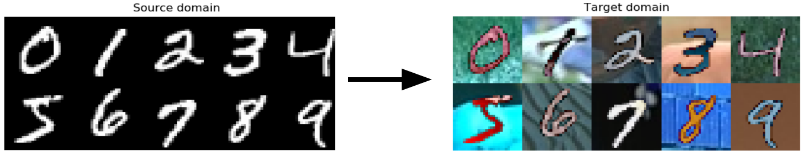

# Pytorch Adversarial Domain Adaptation
A collection of implementations of adversarial unsupervised domain adaptation algorithms.

## Domain adaptation

The goal of domain adaptation is to transfer the knowledge of a model to a different but related data distribution.
The model is trained on a *source* dataset and applied to a *target* dataset (usually unlabeled).
In this case, the model is trained on regular MNIST images, but we want to get good performance on MNIST with random color (without any labels).

In adversarial domain adaptation, this problem is usually solved by training an auxiliary model called the domain discriminator. The goal of this model is to classify examples as coming from the source or target distribution. The original classifier will then try to maximize the loss of the domain discriminator, comparable to the GAN training procedure.

## Results

Method      | Accuracy on MNIST-M | Parameters
------------|---------------------|-----------
Source only | 0.33                |
RevGrad     | 0.74                | default
ADDA        | 0.76                | default
WDGRL       | 0.78                | `--k-clf 10 --wd-clf 0.1`

## Instructions
1. Download the [BSDS500 dataset](https://www2.eecs.berkeley.edu/Research/Projects/CS/vision/grouping/resources.html#bsds500) and extract it somewhere. Point the `DATA_DIR` variable in `config.py` to this location.
2. In a Python 3.6 environment, run:
```
$ conda install pytorch torchvision numpy -c pytorch
$ pip install tqdm opencv-python
```
3. Train a model on the source dataset with
```
$ python train_source.py
```
4. Choose an algorithm and pass it the pretrained network, for example:
```
$ python adda.py trained_models/source.pt
```
